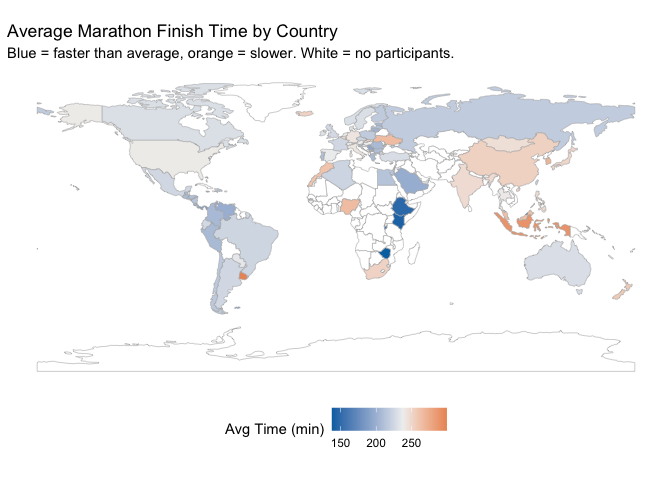
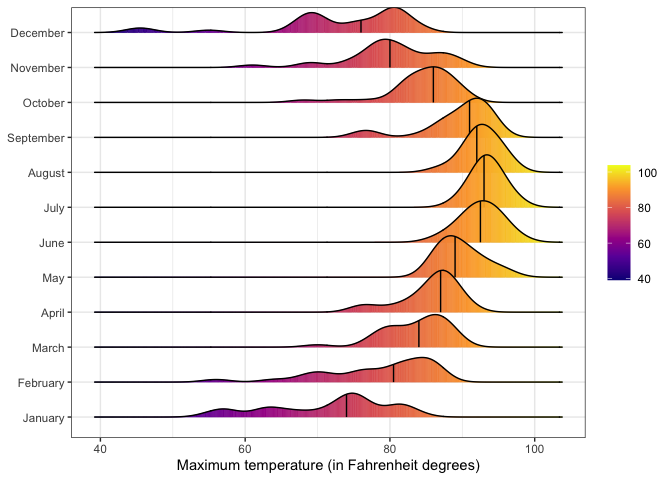

# Data Visualization and Reproducible Research

> Sebastian Siedler — ssiedler3117@floridapoly.edu

The following is a sample of products created during the _"Data Visualization and Reproducible Research"_ course (CAP5735, Florida Polytechnic University).

---

## Project 01

In the `project-01/` folder you can find a revised version of Mini-Project 01, which explored the **World Cup Matches** dataset (1930–2014). The analysis includes three static visualizations (goals over time, top teams by home wins, and average attendance per tournament), one interactive plotly chart with year/host/average goals/match count in the tooltip, and a before/after chart redesign demonstrating the improvement from default ggplot2 styling to a sorted, colorblind-safe viridis bar chart.

**Sample data visualization:**

---

## Project 02

In `project-02/` you can find a revised version of Mini-Project 02, which explored the **2017 Boston Marathon** results dataset (~26,000 finishers, 100+ countries). Visualizations include interactive histograms (age and finish time distributions), a choropleth world map of average finish times by country using Natural Earth shapefiles, a finish time histogram showing the "round number" effect, a median time by age/gender chart, and a linear model coefficient plot. A before/after redesign section demonstrates the switch from a non-colorblind-safe red/blue palette to the Okabe-Ito palette (blue/orange).

**Sample data visualization:**

---

## Project 03

In `project-03/` you can find work on Tampa International Airport weather data (2022) and the UCI Concrete Compressive Strength dataset. Part 1 reproduces density and ridgeline plots of daily maximum temperatures across all 12 months, plus a custom precipitation bar chart highlighting Florida's rainy season. Part 2 explores the concrete dataset through histograms, a grouped boxplot of strength by curing age, and a scatterplot mapping cement, age, and water content simultaneously. An interactive plotly version of the precipitation chart and a before/after redesign (replacing an informal rainbow palette with the perceptually-ordered viridis palette) are also included.

**Sample data visualization:**

---

## Moving Forward

This course provided a solid foundation in exploratory data visualization and reproducible research with R. The most valuable takeaways were: (1) the importance of choosing chart types that match the nature of the data (distributions, comparisons, relationships), (2) accessibility considerations — colorblind-safe palettes and alt text are not optional extras but prerequisites for responsible communication, and (3) the power of interactivity to let readers engage with data at their own level of detail. Going forward, I plan to explore animated visualizations (e.g., `gganimate`) and experiment with dashboard tools like Shiny to build more dynamic, self-service data products.
