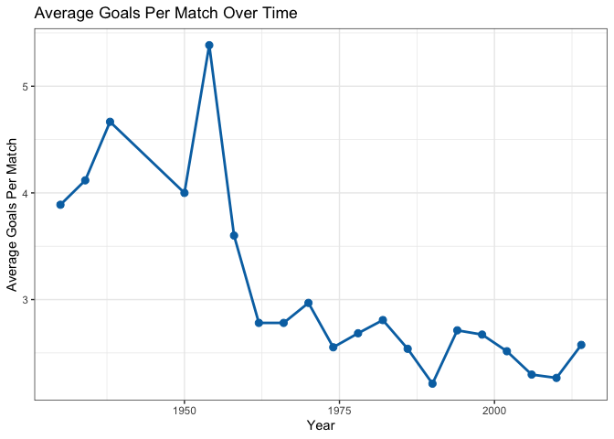
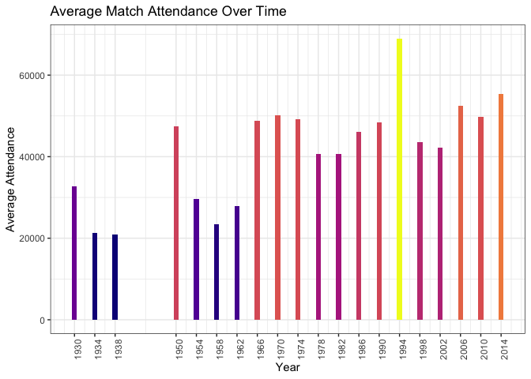
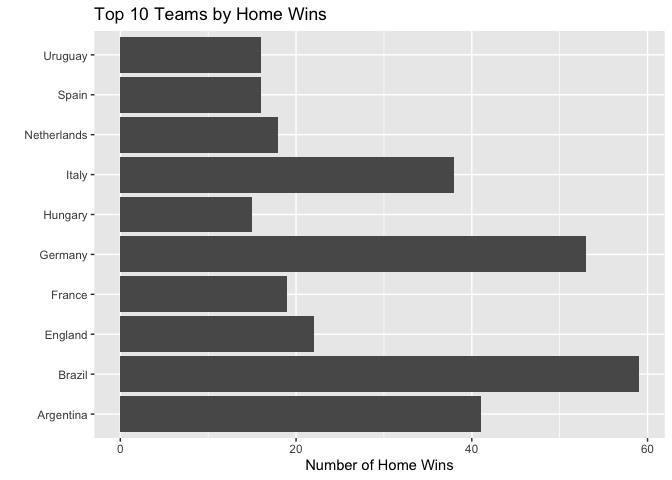
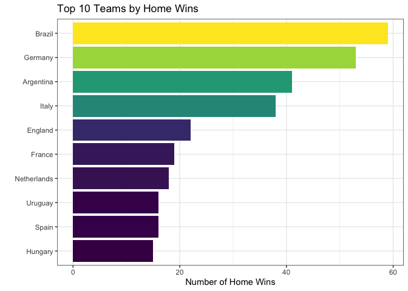

# Data Visualization Project 01

## Data Summary

The World Cup Matches dataset contains 852 matches from 1930 to 2014 (after removing blank rows). Each row represents one match with information about the teams, goals, attendance, and tournament stage.


``` r
library(tidyverse)
library(plotly)

df <- read_csv("../data/WorldCupMatches.csv", col_types = cols()) %>%
  filter(!is.na(Year)) %>%
  mutate(TotalGoals = `Home Team Goals` + `Away Team Goals`)

glimpse(df)
```

```
## Rows: 852
## Columns: 21
## $ Year                   <dbl> 1930, 1930, 1930, 1930, 1930, 1930, 1930, 1930,…
## $ Datetime               <chr> "13 Jul 1930 - 15:00", "13 Jul 1930 - 15:00", "…
## $ Stage                  <chr> "Group 1", "Group 4", "Group 2", "Group 3", "Gr…
## $ Stadium                <chr> "Pocitos", "Parque Central", "Parque Central", …
## $ City                   <chr> "Montevideo", "Montevideo", "Montevideo", "Mont…
## $ `Home Team Name`       <chr> "France", "USA", "Yugoslavia", "Romania", "Arge…
## $ `Home Team Goals`      <dbl> 4, 3, 2, 3, 1, 3, 4, 3, 1, 1, 6, 4, 1, 4, 3, 6,…
## $ `Away Team Goals`      <dbl> 1, 0, 1, 1, 0, 0, 0, 0, 0, 0, 3, 0, 0, 0, 1, 1,…
## $ `Away Team Name`       <chr> "Mexico", "Belgium", "Brazil", "Peru", "France"…
## $ `Win conditions`       <chr> NA, NA, NA, NA, NA, NA, NA, NA, NA, NA, NA, NA,…
## $ Attendance             <dbl> 4444, 18346, 24059, 2549, 23409, 9249, 18306, 1…
## $ `Half-time Home Goals` <dbl> 3, 2, 2, 1, 0, 1, 0, 2, 0, 0, 3, 1, 1, 4, 2, 1,…
## $ `Half-time Away Goals` <dbl> 0, 0, 0, 0, 0, 0, 0, 0, 0, 0, 1, 0, 0, 0, 1, 0,…
## $ Referee                <chr> "LOMBARDI Domingo (URU)", "MACIAS Jose (ARG)", …
## $ `Assistant 1`          <chr> "CRISTOPHE Henry (BEL)", "MATEUCCI Francisco (U…
## $ `Assistant 2`          <chr> "REGO Gilberto (BRA)", "WARNKEN Alberto (CHI)",…
## $ RoundID                <dbl> 201, 201, 201, 201, 201, 201, 201, 201, 201, 20…
## $ MatchID                <dbl> 1096, 1090, 1093, 1098, 1085, 1095, 1092, 1097,…
## $ `Home Team Initials`   <chr> "FRA", "USA", "YUG", "ROU", "ARG", "CHI", "YUG"…
## $ `Away Team Initials`   <chr> "MEX", "BEL", "BRA", "PER", "FRA", "MEX", "BOL"…
## $ TotalGoals             <dbl> 5, 3, 3, 4, 1, 3, 4, 3, 1, 1, 9, 4, 1, 4, 4, 7,…
```

## Visualization 1: Average Goals Per Match Over Time

This line chart shows how the average number of goals per match has changed across World Cup tournaments. There is a clear downward trend since the high-scoring era of the 1950s, reflecting tactical evolution in the sport. The average height of goalkeepers has also increased over time — Buffon once suggested enlarging the goal size to compensate.


``` r
goals_by_year <- df %>%
  group_by(Year) %>%
  summarize(avg_goals = mean(TotalGoals), .groups = "drop")

ggplot(goals_by_year, aes(x = Year, y = avg_goals)) +
  geom_line(color = "#0072B2", linewidth = 1) +
  geom_point(color = "#0072B2", size = 2.5) +
  labs(
    title = "Average Goals Per Match Over Time",
    x = "Year",
    y = "Average Goals Per Match"
  ) +
  theme_bw()
```



## Visualization 2: Top 10 Teams by Home Wins

This plot shows which national teams have the most home wins in World Cup history. Brazil leads comfortably, reflecting their status as the most successful World Cup nation. Germany FR and Germany wins are combined to reflect that they are historically the same national team.


``` r
home_wins <- df %>%
  filter(`Home Team Goals` > `Away Team Goals`) %>%
  mutate(Team = if_else(
    `Home Team Name` %in% c("Germany", "Germany FR"), "Germany", `Home Team Name`
  )) %>%
  count(Team, sort = TRUE) %>%
  head(10)

ggplot(home_wins, aes(x = n, y = reorder(Team, n), fill = n)) +
  geom_col() +
  scale_fill_viridis_c(option = "viridis", guide = "none") +
  labs(
    title = "Top 10 Teams by Home Wins",
    x = "Number of Home Wins",
    y = ""
  ) +
  theme_bw()
```


## Visualization 3: Average Attendance Over Time

This plot shows how average match attendance has grown over the decades, with a notable spike in 1994 when the US hosted the World Cup. The gap from 1939 to 1949 reflects World War II. Individual year labels on the x-axis make the gap and the 1994 spike easier to identify.


``` r
att_by_year <- df %>%
  group_by(Year) %>%
  summarize(avg_att = mean(Attendance, na.rm = TRUE), .groups = "drop")

ggplot(att_by_year, aes(x = Year, y = avg_att, fill = avg_att)) +
  geom_col(width = 1) +
  scale_fill_viridis_c(option = "plasma", guide = "none") +
  scale_x_continuous(breaks = att_by_year$Year) +
  theme_bw() +
  theme(axis.text.x = element_text(angle = 90, hjust = 1)) +
  labs(
    title = "Average Match Attendance Over Time",
    x = "Year",
    y = "Average Attendance"
  )
```



## Visualization 4 (Interactive): Goals Over Time

The static line chart above shows the trend, but hovering over each point reveals the exact average goals value, the tournament year, and the host country. The host country is useful context — for example, the 1994 spike in attendance (Viz 3) and the drop in goals can both be cross-referenced here without leaving the chart.


``` r
host_country <- c(
  "1930" = "Uruguay", "1934" = "Italy", "1938" = "France",
  "1950" = "Brazil", "1954" = "Switzerland", "1958" = "Sweden",
  "1962" = "Chile", "1966" = "England", "1970" = "Mexico",
  "1974" = "West Germany", "1978" = "Argentina", "1982" = "Spain",
  "1986" = "Mexico", "1990" = "Italy", "1994" = "United States",
  "1998" = "France", "2002" = "S. Korea / Japan", "2006" = "Germany",
  "2010" = "South Africa", "2014" = "Brazil"
)

goals_by_year <- goals_by_year %>%
  mutate(Host = host_country[as.character(Year)])

p <- ggplot(goals_by_year, aes(
  x = Year, y = avg_goals,
  text = paste0(
    "Year: ", Year,
    "\nHost: ", Host,
    "\nAvg Goals: ", round(avg_goals, 2)
  )
)) +
  geom_line(color = "#0072B2", linewidth = 1) +
  geom_point(color = "#0072B2", size = 2.5) +
  labs(
    title = "Average Goals Per Match Over Time (Interactive)",
    x = "Year",
    y = "Average Goals Per Match"
  ) +
  theme_bw()

ggplotly(p, tooltip = "text")
```

```{=html}
<div class="plotly html-widget html-fill-item" id="htmlwidget-140f77e12270de435e63" style="width:672px;height:480px;"></div>
<script type="application/json" data-for="htmlwidget-140f77e12270de435e63">{"x":{"data":[{"x":[1930,null,1934,null,1938,null,1950,null,1954,null,1958,null,1962,null,1966,null,1970,null,1974,null,1978,null,1982,null,1986,null,1990,null,1994,null,1998,null,2002,null,2006,null,2010,null,2014],"y":[3.8888888888888888,null,4.117647058823529,null,4.666666666666667,null,4,null,5.384615384615385,null,3.6000000000000001,null,2.78125,null,2.78125,null,2.96875,null,2.5526315789473686,null,2.6842105263157894,null,2.8076923076923075,null,2.5384615384615383,null,2.2115384615384617,null,2.7115384615384617,null,2.671875,null,2.515625,null,2.296875,null,2.265625,null,2.5750000000000002],"text":["Year: 1930<br />Host: Uruguay<br />Avg Goals: 3.89",null,"Year: 1934<br />Host: Italy<br />Avg Goals: 4.12",null,"Year: 1938<br />Host: France<br />Avg Goals: 4.67",null,"Year: 1950<br />Host: Brazil<br />Avg Goals: 4",null,"Year: 1954<br />Host: Switzerland<br />Avg Goals: 5.38",null,"Year: 1958<br />Host: Sweden<br />Avg Goals: 3.6",null,"Year: 1962<br />Host: Chile<br />Avg Goals: 2.78",null,"Year: 1966<br />Host: England<br />Avg Goals: 2.78",null,"Year: 1970<br />Host: Mexico<br />Avg Goals: 2.97",null,"Year: 1974<br />Host: West Germany<br />Avg Goals: 2.55",null,"Year: 1978<br />Host: Argentina<br />Avg Goals: 2.68",null,"Year: 1982<br />Host: Spain<br />Avg Goals: 2.81",null,"Year: 1986<br />Host: Mexico<br />Avg Goals: 2.54",null,"Year: 1990<br />Host: Italy<br />Avg Goals: 2.21",null,"Year: 1994<br />Host: United States<br />Avg Goals: 2.71",null,"Year: 1998<br />Host: France<br />Avg Goals: 2.67",null,"Year: 2002<br />Host: S. Korea / Japan<br />Avg Goals: 2.52",null,"Year: 2006<br />Host: Germany<br />Avg Goals: 2.3",null,"Year: 2010<br />Host: South Africa<br />Avg Goals: 2.27",null,"Year: 2014<br />Host: Brazil<br />Avg Goals: 2.58"],"type":"scatter","mode":"lines","line":{"width":3.7795275590551185,"color":"rgba(0,114,178,1)","dash":"solid"},"hoveron":"points","showlegend":false,"xaxis":"x","yaxis":"y","hoverinfo":"text","frame":null},{"x":[1930,1934,1938,1950,1954,1958,1962,1966,1970,1974,1978,1982,1986,1990,1994,1998,2002,2006,2010,2014],"y":[3.8888888888888888,4.117647058823529,4.666666666666667,4,5.384615384615385,3.6000000000000001,2.78125,2.78125,2.96875,2.5526315789473686,2.6842105263157894,2.8076923076923075,2.5384615384615383,2.2115384615384617,2.7115384615384617,2.671875,2.515625,2.296875,2.265625,2.5750000000000002],"text":["Year: 1930<br />Host: Uruguay<br />Avg Goals: 3.89","Year: 1934<br />Host: Italy<br />Avg Goals: 4.12","Year: 1938<br />Host: France<br />Avg Goals: 4.67","Year: 1950<br />Host: Brazil<br />Avg Goals: 4","Year: 1954<br />Host: Switzerland<br />Avg Goals: 5.38","Year: 1958<br />Host: Sweden<br />Avg Goals: 3.6","Year: 1962<br />Host: Chile<br />Avg Goals: 2.78","Year: 1966<br />Host: England<br />Avg Goals: 2.78","Year: 1970<br />Host: Mexico<br />Avg Goals: 2.97","Year: 1974<br />Host: West Germany<br />Avg Goals: 2.55","Year: 1978<br />Host: Argentina<br />Avg Goals: 2.68","Year: 1982<br />Host: Spain<br />Avg Goals: 2.81","Year: 1986<br />Host: Mexico<br />Avg Goals: 2.54","Year: 1990<br />Host: Italy<br />Avg Goals: 2.21","Year: 1994<br />Host: United States<br />Avg Goals: 2.71","Year: 1998<br />Host: France<br />Avg Goals: 2.67","Year: 2002<br />Host: S. Korea / Japan<br />Avg Goals: 2.52","Year: 2006<br />Host: Germany<br />Avg Goals: 2.3","Year: 2010<br />Host: South Africa<br />Avg Goals: 2.27","Year: 2014<br />Host: Brazil<br />Avg Goals: 2.58"],"type":"scatter","mode":"markers","marker":{"autocolorscale":false,"color":"rgba(0,114,178,1)","opacity":1,"size":9.4488188976377963,"symbol":"circle","line":{"width":1.8897637795275593,"color":"rgba(0,114,178,1)"}},"hoveron":"points","showlegend":false,"xaxis":"x","yaxis":"y","hoverinfo":"text","frame":null}],"layout":{"margin":{"t":40.840182648401829,"r":7.3059360730593621,"b":37.260273972602747,"l":31.415525114155255},"plot_bgcolor":"rgba(255,255,255,1)","paper_bgcolor":"rgba(255,255,255,1)","font":{"color":"rgba(0,0,0,1)","family":"","size":14.611872146118724},"title":{"text":"Average Goals Per Match Over Time (Interactive)","font":{"color":"rgba(0,0,0,1)","family":"","size":17.534246575342465},"x":0,"xref":"paper"},"xaxis":{"domain":[0,1],"automargin":true,"type":"linear","autorange":false,"range":[1925.8,2018.2],"tickmode":"array","ticktext":["1950","1975","2000"],"tickvals":[1950,1975,2000],"categoryorder":"array","categoryarray":["1950","1975","2000"],"nticks":null,"ticks":"outside","tickcolor":"rgba(51,51,51,1)","ticklen":3.6529680365296811,"tickwidth":0.66417600664176002,"showticklabels":true,"tickfont":{"color":"rgba(77,77,77,1)","family":"","size":11.68949771689498},"tickangle":-0,"showline":false,"linecolor":null,"linewidth":0,"showgrid":true,"gridcolor":"rgba(235,235,235,1)","gridwidth":0.66417600664176002,"zeroline":false,"anchor":"y","title":{"text":"Year","font":{"color":"rgba(0,0,0,1)","family":"","size":14.611872146118724}},"hoverformat":".2f"},"yaxis":{"domain":[0,1],"automargin":true,"type":"linear","autorange":false,"range":[2.0528846153846154,5.5432692307692308],"tickmode":"array","ticktext":["3","4","5"],"tickvals":[3,4,5],"categoryorder":"array","categoryarray":["3","4","5"],"nticks":null,"ticks":"outside","tickcolor":"rgba(51,51,51,1)","ticklen":3.6529680365296811,"tickwidth":0.66417600664176002,"showticklabels":true,"tickfont":{"color":"rgba(77,77,77,1)","family":"","size":11.68949771689498},"tickangle":-0,"showline":false,"linecolor":null,"linewidth":0,"showgrid":true,"gridcolor":"rgba(235,235,235,1)","gridwidth":0.66417600664176002,"zeroline":false,"anchor":"x","title":{"text":"Average Goals Per Match","font":{"color":"rgba(0,0,0,1)","family":"","size":14.611872146118724}},"hoverformat":".2f"},"shapes":[{"type":"rect","fillcolor":"rgba(255,255,255,1)","line":{"color":"rgba(51,51,51,1)","width":0.66417600664176002,"linetype":"solid"},"yref":"paper","xref":"paper","layer":"below","x0":0,"x1":1,"y0":0,"y1":1}],"showlegend":false,"legend":{"bgcolor":"rgba(255,255,255,1)","bordercolor":"transparent","borderwidth":1.8897637795275593,"font":{"color":"rgba(0,0,0,1)","family":"","size":11.68949771689498}},"hovermode":"closest","barmode":"relative"},"config":{"doubleClick":"reset","modeBarButtonsToAdd":["hoverclosest","hovercompare"],"showSendToCloud":false},"source":"A","attrs":{"a53e2efa9af3":{"x":{},"y":{},"text":{},"type":"scatter"},"a53e46d2df9d":{"x":{},"y":{},"text":{}}},"cur_data":"a53e2efa9af3","visdat":{"a53e2efa9af3":["function (y) ","x"],"a53e46d2df9d":["function (y) ","x"]},"highlight":{"on":"plotly_click","persistent":false,"dynamic":false,"selectize":false,"opacityDim":0.20000000000000001,"selected":{"opacity":1},"debounce":0},"shinyEvents":["plotly_hover","plotly_click","plotly_selected","plotly_relayout","plotly_brushed","plotly_brushing","plotly_clickannotation","plotly_doubleclick","plotly_deselect","plotly_afterplot","plotly_sunburstclick"],"base_url":"https://plot.ly"},"evals":[],"jsHooks":[]}</script>
```

## Before / After Redesign

The original "Top 10 Teams by Home Wins" chart (Visualization 2 in the original mini-project submission) used the default ggplot2 styling: a single flat grey fill, a white-on-grey grid background, and no ordering of the bars. This makes comparison harder and the chart looks unfinished.

**What was wrong:**

- All bars the same default grey — no visual hierarchy
- Bars not sorted, so ranking is not immediately readable
- No theme customization (`theme_gray()` default)

**Before (reproduction of original chart):**


``` r
ggplot(home_wins, aes(x = n, y = `Team`)) +
  geom_col() +
  labs(
    title = "Top 10 Teams by Home Wins",
    x = "Number of Home Wins",
    y = ""
  )
```



**After (redesigned):**

- Bars sorted by value for immediate rank reading
- Colorblind-safe viridis fill encodes the magnitude redundantly with bar length
- `theme_bw()` removes chartjunk and improves contrast


``` r
ggplot(home_wins, aes(x = n, y = reorder(Team, n), fill = n)) +
  geom_col() +
  scale_fill_viridis_c(option = "viridis", guide = "none") +
  labs(
    title = "Top 10 Teams by Home Wins",
    x = "Number of Home Wins",
    y = ""
  ) +
  theme_bw()
```



## Discussion

**a. What were the original charts you planned to create?**

I planned three charts: a line chart showing goals per match over time, a bar chart of the most successful teams by home wins, and a bar chart of average attendance trends across tournaments.

**b. What story could you tell with your plots?**

The three plots together tell a story about how World Cup football has evolved. Goals per game have declined since the high-scoring 1950s as tactics became more defensive. Brazil stands out as the most dominant team historically. Attendance has generally grown, peaking in 1994 when the USA hosted, and the gap between 1938 and 1950 visually marks the absence of tournaments during World War II.

**c. How did you apply the principles of data visualization and design?**

I kept the visualizations clean and purposeful. Each chart has a clear title and labeled axes. I used line charts for trends over time and bar charts for comparisons. In the revised version, I applied colorblind-safe viridis palettes so color encodes the same dimension as bar length (redundant encoding improves readability). `theme_bw()` removes unnecessary ink. The interactive version of Viz 1 allows readers to inspect precise values that would require guessing from a static axis. Missing data (blank rows) was filtered before analysis to ensure accuracy.
