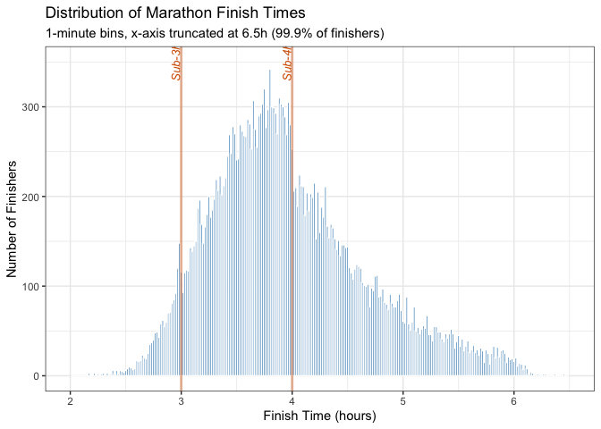
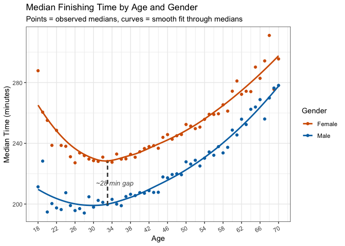
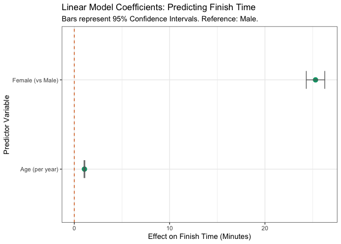
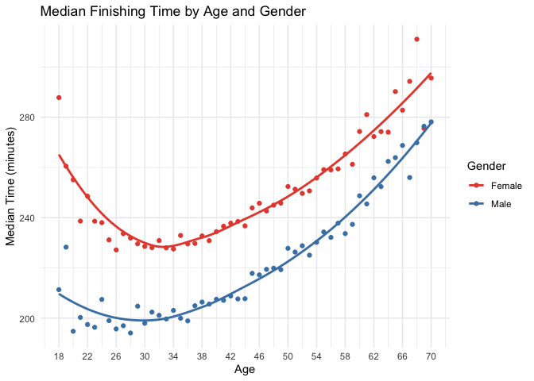
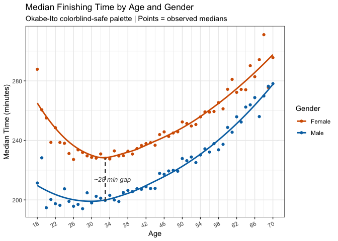

# Data Visualization Project 02


## Data Loading and Preparation

The dataset used is the Boston Marathon 2017 results. It contains information on all finishers including their name, age, gender, origin (city, state, country), split times at every 5K mark, pace, and official finishing time.


``` r
df <- read_csv("../data/marathon_results_2017.csv")

time_to_minutes <- function(x) {
  ifelse(x == "-" | is.na(x), NA,
    period_to_seconds(hms(x)) / 60
  )
}

df <- df %>%
  mutate(
    Official_Time_min = time_to_minutes(`Official Time`),
    Age = as.numeric(Age),
    Pace_min = time_to_minutes(Pace)
  )
```


``` r
glimpse(df)
```

```
## Rows: 26,410
## Columns: 24
## $ Bib               <chr> "11", "17", "23", "21", "9", "15", "63", "7", "18", …
## $ Name              <chr> "Kirui, Geoffrey", "Rupp, Galen", "Osako, Suguru", "…
## $ Age               <dbl> 24, 30, 25, 32, 31, 40, 33, 28, 27, 28, 32, 32, 41, …
## $ `M/F`             <chr> "M", "M", "M", "M", "M", "M", "M", "M", "M", "M", "M…
## $ City              <chr> "Keringet", "Portland", "Machida-City", "Mammoth Lak…
## $ State             <chr> NA, "OR", NA, "CA", NA, "AZ", "CO", NA, "OR", "UT", …
## $ Country           <chr> "KEN", "USA", "JPN", "USA", "KEN", "USA", "USA", "ET…
## $ `5K`              <time> 00:15:25, 00:15:24, 00:15:25, 00:15:25, 00:15:25, 0…
## $ `10K`             <chr> "0:30:28", "0:30:27", "0:30:29", "0:30:29", "0:30:28…
## $ `15K`             <chr> "0:45:44", "0:45:44", "0:45:44", "0:45:44", "0:45:44…
## $ `20K`             <chr> "1:01:15", "1:01:15", "1:01:16", "1:01:19", "1:01:15…
## $ Half              <time> 01:04:35, 01:04:35, 01:04:36, 01:04:45, 01:04:35, 0…
## $ `25K`             <time> 01:16:59, 01:16:59, 01:17:00, 01:17:00, 01:16:59, 0…
## $ `30K`             <time> 01:33:01, 01:33:01, 01:33:01, 01:33:01, 01:33:01, 0…
## $ `35K`             <time> 01:48:19, 01:48:19, 01:48:31, 01:48:58, 01:48:41, 0…
## $ `40K`             <time> 02:02:53, 02:03:14, 02:03:38, 02:04:35, 02:05:00, 0…
## $ Pace              <time> 00:04:57, 00:04:58, 00:04:59, 00:05:03, 00:05:04, 0…
## $ `Proj Time`       <chr> "-", "-", "-", "-", "-", "-", "-", "-", "-", "-", "-…
## $ `Official Time`   <time> 02:09:37, 02:09:58, 02:10:28, 02:12:08, 02:12:35, 0…
## $ Overall           <dbl> 1, 2, 3, 4, 5, 6, 7, 8, 9, 10, 11, 12, 13, 14, 15, 1…
## $ Gender            <dbl> 1, 2, 3, 4, 5, 6, 7, 8, 9, 10, 11, 12, 13, 14, 15, 1…
## $ Division          <dbl> 1, 2, 3, 4, 5, 1, 6, 7, 8, 9, 10, 11, 2, 12, 13, 14,…
## $ Official_Time_min <dbl> 129.6167, 129.9667, 130.4667, 132.1333, 132.5833, 13…
## $ Pace_min          <dbl> 4.950000, 4.966667, 4.983333, 5.050000, 5.066667, 5.…
```

## Summary of the Data


``` r
df %>%
  summarise(
    Total_Runners = n(),
    Countries = n_distinct(Country),
    Median_Age = median(Age, na.rm = TRUE),
    Median_Time = median(Official_Time_min, na.rm = TRUE),
    Female_Pct = mean(`M/F` == "F", na.rm = TRUE) * 100
  )
```

```
## # A tibble: 1 × 5
##   Total_Runners Countries Median_Age Median_Time Female_Pct
##           <int>     <int>      <dbl>       <dbl>      <dbl>
## 1         26410        91         43        232.       45.3
```

## Visualization 1 (Interactive): Age and Finish Time Distributions

An interactive look at the distributions of runner ages and official finishing times, created using `plotly`. Hovering over each bar reveals the exact count, bin range, and percentage of runners, which a static histogram cannot show without cluttering the plot with labels.


``` r
compute_hist_df <- function(x, bins = 30) {
  h <- hist(x, breaks = bins, plot = FALSE)
  total <- length(x)
  data.frame(
    mids = h$mids,
    count = h$counts,
    pct = h$counts / total * 100,
    bin_start = head(h$breaks, -1),
    bin_end = tail(h$breaks, -1)
  )
}

age_hist_df <- compute_hist_df(df$Age)

ggplotly(
  ggplot(age_hist_df, aes(
    x = mids, y = count,
    text = paste0(
      "Count: ", count,
      "\nRange: ", round(bin_start, 1), "\u2013", round(bin_end, 1),
      "\nPercent: ", round(pct, 1), "%"
    )
  )) +
    geom_col(
      fill = "#0072B2", color = "white", alpha = 0.85,
      width = diff(age_hist_df$bin_start)[1]
    ) +
    labs(title = "Age Distribution", x = "Age", y = "Count") +
    theme_bw(),
  tooltip = "text"
)
```

```{=html}
<div class="plotly html-widget html-fill-item" id="htmlwidget-e283be3314cfbc374eac" style="width:672px;height:480px;"></div>
<script type="application/json" data-for="htmlwidget-e283be3314cfbc374eac">{"x":{"data":[{"orientation":"v","width":[2,2,2,2,2,2,2,2,2,2,2,2,2,2,2,2,2,2,2,2,2,2,2,2,2,2,2,2,2,2,2,2,2],"base":[0,0,0,0,0,0,0,0,0,0,0,0,0,0,0,0,0,0,0,0,0,0,0,0,0,0,0,0,0,0,0,0,0],"x":[19,21,23,25,27,29,31,33,35,37,39,41,43,45,47,49,51,53,55,57,59,61,63,65,67,69,71,73,75,77,79,81,83],"y":[146,357,757,1055,1161,1265,1146,1131,1533,1357,1638,1559,1357,2103,1627,1501,1296,1057,1186,765,776,620,274,324,167,125,44,39,25,9,6,2,2],"text":["Count: 146<br />Range: 18–20<br />Percent: 0.6%","Count: 357<br />Range: 20–22<br />Percent: 1.4%","Count: 757<br />Range: 22–24<br />Percent: 2.9%","Count: 1055<br />Range: 24–26<br />Percent: 4%","Count: 1161<br />Range: 26–28<br />Percent: 4.4%","Count: 1265<br />Range: 28–30<br />Percent: 4.8%","Count: 1146<br />Range: 30–32<br />Percent: 4.3%","Count: 1131<br />Range: 32–34<br />Percent: 4.3%","Count: 1533<br />Range: 34–36<br />Percent: 5.8%","Count: 1357<br />Range: 36–38<br />Percent: 5.1%","Count: 1638<br />Range: 38–40<br />Percent: 6.2%","Count: 1559<br />Range: 40–42<br />Percent: 5.9%","Count: 1357<br />Range: 42–44<br />Percent: 5.1%","Count: 2103<br />Range: 44–46<br />Percent: 8%","Count: 1627<br />Range: 46–48<br />Percent: 6.2%","Count: 1501<br />Range: 48–50<br />Percent: 5.7%","Count: 1296<br />Range: 50–52<br />Percent: 4.9%","Count: 1057<br />Range: 52–54<br />Percent: 4%","Count: 1186<br />Range: 54–56<br />Percent: 4.5%","Count: 765<br />Range: 56–58<br />Percent: 2.9%","Count: 776<br />Range: 58–60<br />Percent: 2.9%","Count: 620<br />Range: 60–62<br />Percent: 2.3%","Count: 274<br />Range: 62–64<br />Percent: 1%","Count: 324<br />Range: 64–66<br />Percent: 1.2%","Count: 167<br />Range: 66–68<br />Percent: 0.6%","Count: 125<br />Range: 68–70<br />Percent: 0.5%","Count: 44<br />Range: 70–72<br />Percent: 0.2%","Count: 39<br />Range: 72–74<br />Percent: 0.1%","Count: 25<br />Range: 74–76<br />Percent: 0.1%","Count: 9<br />Range: 76–78<br />Percent: 0%","Count: 6<br />Range: 78–80<br />Percent: 0%","Count: 2<br />Range: 80–82<br />Percent: 0%","Count: 2<br />Range: 82–84<br />Percent: 0%"],"type":"bar","textposition":"none","marker":{"autocolorscale":false,"color":"rgba(0,114,178,0.85)","line":{"width":1.8897637795275593,"color":"rgba(255,255,255,1)"}},"showlegend":false,"xaxis":"x","yaxis":"y","hoverinfo":"text","frame":null}],"layout":{"margin":{"t":40.840182648401829,"r":7.3059360730593621,"b":37.260273972602747,"l":48.949771689497723},"plot_bgcolor":"rgba(255,255,255,1)","paper_bgcolor":"rgba(255,255,255,1)","font":{"color":"rgba(0,0,0,1)","family":"","size":14.611872146118724},"title":{"text":"Age Distribution","font":{"color":"rgba(0,0,0,1)","family":"","size":17.534246575342465},"x":0,"xref":"paper"},"xaxis":{"domain":[0,1],"automargin":true,"type":"linear","autorange":false,"range":[14.699999999999999,87.299999999999997],"tickmode":"array","ticktext":["20","40","60","80"],"tickvals":[20,40,60,80],"categoryorder":"array","categoryarray":["20","40","60","80"],"nticks":null,"ticks":"outside","tickcolor":"rgba(51,51,51,1)","ticklen":3.6529680365296811,"tickwidth":0.66417600664176002,"showticklabels":true,"tickfont":{"color":"rgba(77,77,77,1)","family":"","size":11.68949771689498},"tickangle":-0,"showline":false,"linecolor":null,"linewidth":0,"showgrid":true,"gridcolor":"rgba(235,235,235,1)","gridwidth":0.66417600664176002,"zeroline":false,"anchor":"y","title":{"text":"Age","font":{"color":"rgba(0,0,0,1)","family":"","size":14.611872146118724}},"hoverformat":".2f"},"yaxis":{"domain":[0,1],"automargin":true,"type":"linear","autorange":false,"range":[-105.15000000000001,2208.1500000000001],"tickmode":"array","ticktext":["0","500","1000","1500","2000"],"tickvals":[0,500,1000.0000000000001,1499.9999999999998,2000],"categoryorder":"array","categoryarray":["0","500","1000","1500","2000"],"nticks":null,"ticks":"outside","tickcolor":"rgba(51,51,51,1)","ticklen":3.6529680365296811,"tickwidth":0.66417600664176002,"showticklabels":true,"tickfont":{"color":"rgba(77,77,77,1)","family":"","size":11.68949771689498},"tickangle":-0,"showline":false,"linecolor":null,"linewidth":0,"showgrid":true,"gridcolor":"rgba(235,235,235,1)","gridwidth":0.66417600664176002,"zeroline":false,"anchor":"x","title":{"text":"Count","font":{"color":"rgba(0,0,0,1)","family":"","size":14.611872146118724}},"hoverformat":".2f"},"shapes":[{"type":"rect","fillcolor":"rgba(255,255,255,1)","line":{"color":"rgba(51,51,51,1)","width":0.66417600664176002,"linetype":"solid"},"yref":"paper","xref":"paper","layer":"below","x0":0,"x1":1,"y0":0,"y1":1}],"showlegend":false,"legend":{"bgcolor":"rgba(255,255,255,1)","bordercolor":"transparent","borderwidth":1.8897637795275593,"font":{"color":"rgba(0,0,0,1)","family":"","size":11.68949771689498}},"hovermode":"closest","barmode":"relative"},"config":{"doubleClick":"reset","modeBarButtonsToAdd":["hoverclosest","hovercompare"],"showSendToCloud":false},"source":"A","attrs":{"1223238747977":{"x":{},"y":{},"text":{},"type":"bar"}},"cur_data":"1223238747977","visdat":{"1223238747977":["function (y) ","x"]},"highlight":{"on":"plotly_click","persistent":false,"dynamic":false,"selectize":false,"opacityDim":0.20000000000000001,"selected":{"opacity":1},"debounce":0},"shinyEvents":["plotly_hover","plotly_click","plotly_selected","plotly_relayout","plotly_brushed","plotly_brushing","plotly_clickannotation","plotly_doubleclick","plotly_deselect","plotly_afterplot","plotly_sunburstclick"],"base_url":"https://plot.ly"},"evals":[],"jsHooks":[]}</script>
```


``` r
time_hist_df <- compute_hist_df(df$Official_Time_min)

ggplotly(
  ggplot(time_hist_df, aes(
    x = mids, y = count,
    text = paste0(
      "Count: ", count,
      "\nRange: ", round(bin_start, 1), "\u2013", round(bin_end, 1),
      "\nPercent: ", round(pct, 1), "%"
    )
  )) +
    geom_col(
      fill = "#009E73", color = "white", alpha = 0.85,
      width = diff(time_hist_df$bin_start)[1]
    ) +
    labs(title = "Finishing Time Distribution", x = "Time (minutes)", y = "Count") +
    theme_bw(),
  tooltip = "text"
)
```

```{=html}
<div class="plotly html-widget html-fill-item" id="htmlwidget-536eb66f47ae3655f610" style="width:672px;height:480px;"></div>
<script type="application/json" data-for="htmlwidget-536eb66f47ae3655f610">{"x":{"data":[{"orientation":"v","width":[10,10,10,10,10,10,10,10,10,10,10,10,10,10,10,10,10,10,10,10,10,10,10,10,10,10,10,10,10,10,10,10,10,10,10,10],"base":[0,0,0,0,0,0,0,0,0,0,0,0,0,0,0,0,0,0,0,0,0,0,0,0,0,0,0,0,0,0,0,0,0,0,0,0],"x":[125,135,145,155,165,175,185,195,205,215,225,235,245,255,265,275,285,295,305,315,325,335,345,355,365,375,385,395,405,415,425,435,445,455,465,475],"y":[2,16,38,130,400,869,1371,1828,2393,2712,2957,2915,2036,1865,1488,1152,963,799,597,523,428,323,250,229,97,8,5,3,4,3,2,2,1,0,0,1],"text":["Count: 2<br />Range: 120–130<br />Percent: 0%","Count: 16<br />Range: 130–140<br />Percent: 0.1%","Count: 38<br />Range: 140–150<br />Percent: 0.1%","Count: 130<br />Range: 150–160<br />Percent: 0.5%","Count: 400<br />Range: 160–170<br />Percent: 1.5%","Count: 869<br />Range: 170–180<br />Percent: 3.3%","Count: 1371<br />Range: 180–190<br />Percent: 5.2%","Count: 1828<br />Range: 190–200<br />Percent: 6.9%","Count: 2393<br />Range: 200–210<br />Percent: 9.1%","Count: 2712<br />Range: 210–220<br />Percent: 10.3%","Count: 2957<br />Range: 220–230<br />Percent: 11.2%","Count: 2915<br />Range: 230–240<br />Percent: 11%","Count: 2036<br />Range: 240–250<br />Percent: 7.7%","Count: 1865<br />Range: 250–260<br />Percent: 7.1%","Count: 1488<br />Range: 260–270<br />Percent: 5.6%","Count: 1152<br />Range: 270–280<br />Percent: 4.4%","Count: 963<br />Range: 280–290<br />Percent: 3.6%","Count: 799<br />Range: 290–300<br />Percent: 3%","Count: 597<br />Range: 300–310<br />Percent: 2.3%","Count: 523<br />Range: 310–320<br />Percent: 2%","Count: 428<br />Range: 320–330<br />Percent: 1.6%","Count: 323<br />Range: 330–340<br />Percent: 1.2%","Count: 250<br />Range: 340–350<br />Percent: 0.9%","Count: 229<br />Range: 350–360<br />Percent: 0.9%","Count: 97<br />Range: 360–370<br />Percent: 0.4%","Count: 8<br />Range: 370–380<br />Percent: 0%","Count: 5<br />Range: 380–390<br />Percent: 0%","Count: 3<br />Range: 390–400<br />Percent: 0%","Count: 4<br />Range: 400–410<br />Percent: 0%","Count: 3<br />Range: 410–420<br />Percent: 0%","Count: 2<br />Range: 420–430<br />Percent: 0%","Count: 2<br />Range: 430–440<br />Percent: 0%","Count: 1<br />Range: 440–450<br />Percent: 0%","Count: 0<br />Range: 450–460<br />Percent: 0%","Count: 0<br />Range: 460–470<br />Percent: 0%","Count: 1<br />Range: 470–480<br />Percent: 0%"],"type":"bar","textposition":"none","marker":{"autocolorscale":false,"color":"rgba(0,158,115,0.85)","line":{"width":1.8897637795275593,"color":"rgba(255,255,255,1)"}},"showlegend":false,"xaxis":"x","yaxis":"y","hoverinfo":"text","frame":null}],"layout":{"margin":{"t":40.840182648401829,"r":7.3059360730593621,"b":37.260273972602747,"l":48.949771689497723},"plot_bgcolor":"rgba(255,255,255,1)","paper_bgcolor":"rgba(255,255,255,1)","font":{"color":"rgba(0,0,0,1)","family":"","size":14.611872146118724},"title":{"text":"Finishing Time Distribution","font":{"color":"rgba(0,0,0,1)","family":"","size":17.534246575342465},"x":0,"xref":"paper"},"xaxis":{"domain":[0,1],"automargin":true,"type":"linear","autorange":false,"range":[102,498],"tickmode":"array","ticktext":["200","300","400"],"tickvals":[200,300,400],"categoryorder":"array","categoryarray":["200","300","400"],"nticks":null,"ticks":"outside","tickcolor":"rgba(51,51,51,1)","ticklen":3.6529680365296811,"tickwidth":0.66417600664176002,"showticklabels":true,"tickfont":{"color":"rgba(77,77,77,1)","family":"","size":11.68949771689498},"tickangle":-0,"showline":false,"linecolor":null,"linewidth":0,"showgrid":true,"gridcolor":"rgba(235,235,235,1)","gridwidth":0.66417600664176002,"zeroline":false,"anchor":"y","title":{"text":"Time (minutes)","font":{"color":"rgba(0,0,0,1)","family":"","size":14.611872146118724}},"hoverformat":".2f"},"yaxis":{"domain":[0,1],"automargin":true,"type":"linear","autorange":false,"range":[-147.84999999999999,3104.8499999999999],"tickmode":"array","ticktext":["0","1000","2000","3000"],"tickvals":[0,999.99999999999989,2000,3000],"categoryorder":"array","categoryarray":["0","1000","2000","3000"],"nticks":null,"ticks":"outside","tickcolor":"rgba(51,51,51,1)","ticklen":3.6529680365296811,"tickwidth":0.66417600664176002,"showticklabels":true,"tickfont":{"color":"rgba(77,77,77,1)","family":"","size":11.68949771689498},"tickangle":-0,"showline":false,"linecolor":null,"linewidth":0,"showgrid":true,"gridcolor":"rgba(235,235,235,1)","gridwidth":0.66417600664176002,"zeroline":false,"anchor":"x","title":{"text":"Count","font":{"color":"rgba(0,0,0,1)","family":"","size":14.611872146118724}},"hoverformat":".2f"},"shapes":[{"type":"rect","fillcolor":"rgba(255,255,255,1)","line":{"color":"rgba(51,51,51,1)","width":0.66417600664176002,"linetype":"solid"},"yref":"paper","xref":"paper","layer":"below","x0":0,"x1":1,"y0":0,"y1":1}],"showlegend":false,"legend":{"bgcolor":"rgba(255,255,255,1)","bordercolor":"transparent","borderwidth":1.8897637795275593,"font":{"color":"rgba(0,0,0,1)","family":"","size":11.68949771689498}},"hovermode":"closest","barmode":"relative"},"config":{"doubleClick":"reset","modeBarButtonsToAdd":["hoverclosest","hovercompare"],"showSendToCloud":false},"source":"A","attrs":{"1223267d48d7b":{"x":{},"y":{},"text":{},"type":"bar"}},"cur_data":"1223267d48d7b","visdat":{"1223267d48d7b":["function (y) ","x"]},"highlight":{"on":"plotly_click","persistent":false,"dynamic":false,"selectize":false,"opacityDim":0.20000000000000001,"selected":{"opacity":1},"debounce":0},"shinyEvents":["plotly_hover","plotly_click","plotly_selected","plotly_relayout","plotly_brushed","plotly_brushing","plotly_clickannotation","plotly_doubleclick","plotly_deselect","plotly_afterplot","plotly_sunburstclick"],"base_url":"https://plot.ly"},"evals":[],"jsHooks":[]}</script>
```

## Visualization 2: Average Finish Time by Country

A choropleth map using **sf** showing average official finishing time by country. International runners tend to be faster on average than US-based runners — likely because only the most dedicated athletes travel internationally to compete. Countries with no participants are shown in white to distinguish them from the grey midpoint of the diverging scale.


``` r
country_iso_map <- c(
  GER = "DEU", NED = "NLD", SUI = "CHE", POR = "PRT", CRC = "CRI",
  DEN = "DNK", MAS = "MYS", PHI = "PHL", CHI = "CHL", SIN = "SGP",
  RSA = "ZAF", SLO = "SVN", BER = "BMU", CAY = "CYM", GRE = "GRC",
  CRO = "HRV", HON = "HND", ESA = "SLV", LAT = "LVA", BUL = "BGR",
  ALG = "DZA", BAR = "BRB", INA = "IDN", GRN = "GRD", MGL = "MNG",
  NGR = "NGA", TAN = "TZA", RUS = "RUS", TWN = "TWN", VIE = "VNM",
  LTU = "LTU", PUR = "PRI", BAH = "BHS", GUA = "GTM", NCA = "NIC",
  PAR = "PRY", URU = "URY", ISR = "ISR", KUW = "KWT", QAT = "QAT",
  KSA = "SAU", SRI = "LKA", ZIM = "ZWE", UAE = "ARE", CZE = "CZE",
  TRI = "TTO", TCA = "TCA", MLT = "MLT", SMR = "SMR", AND = "AND",
  NOR = "NOR"
)

country_avg_time <- df %>%
  group_by(Country) %>%
  summarise(Avg_Time = mean(Official_Time_min, na.rm = TRUE), .groups = "drop") %>%
  mutate(ISO3C = countrycode(Country, "iso3c", "iso3c", custom_match = country_iso_map))

world_sf <- st_read("../data/ne_110m_admin_0_countries/ne_110m_admin_0_countries.shp", quiet = TRUE)

world_sf <- world_sf %>%
  left_join(country_avg_time, by = c("ADM0_A3" = "ISO3C"))

overall_avg <- mean(df$Official_Time_min, na.rm = TRUE)

ggplot(world_sf) +
  geom_sf(aes(fill = Avg_Time), color = "grey70", linewidth = 0.2) +
  scale_fill_gradient2(
    low = "#0072B2",
    mid = "#f0f0f0",
    high = "#D55E00",
    midpoint = overall_avg,
    na.value = "#ffffff",
    name = "Avg Time (min)"
  ) +
  labs(
    title = "Average Marathon Finish Time by Country",
    subtitle = "Blue = faster than average, orange = slower. White = no participants."
  ) +
  theme_minimal() +
  theme(
    axis.title = element_blank(), axis.text = element_blank(),
    panel.grid = element_blank(), legend.position = "bottom"
  )
```


## Visualization 3: Histogram of Marathon Finish Times

A histogram of official finishing times in hours. The x-axis is limited to 6.5 hours (only 0.1% of finishers go beyond this). Instead of the smooth bell curve you would expect from a normal distribution, the chart looks like a mountain range with dramatic spikes just before round numbers like 3h and 4h — runners push hard to finish in 3:59:59 rather than 4:00:01. Sub-4 is the most targeted barrier.


``` r
finish_targets <- c(3, 4)

ggplot(df, aes(x = Official_Time_min / 60)) +
  geom_histogram(binwidth = 1 / 60, fill = "#0072B2", color = "white", alpha = 0.85) +
  geom_vline(xintercept = finish_targets, color = "#D55E00", alpha = 0.4, linewidth = 1) +
  annotate("text",
    x = 2.9, y = 350, label = "Sub-3h", angle = 90, vjust = 1.2,
    size = 3.5, color = "#D55E00", fontface = "italic"
  ) +
  annotate("text",
    x = 3.9, y = 350, label = "Sub-4h", angle = 90, vjust = 1.2,
    size = 3.5, color = "#D55E00", fontface = "italic"
  ) +
  xlim(2, 6.5) +
  labs(
    title = "Distribution of Marathon Finish Times",
    subtitle = "1-minute bins, x-axis truncated at 6.5h (99.9% of finishers)",
    x = "Finish Time (hours)", y = "Number of Finishers"
  ) +
  theme_bw()
```



## Visualization 4: Average Time by Age and Gender

Average official finishing time at each individual age (18 to 70), split by gender. We can see that the average time has its minimum in the early 20s to mid-30s. The older you get the slower you tend to be. Also you can clearly see the difference in performance between male and female runners. In the early 30s, male runners tend to be faster (by about 30min) than female runners. I think another interesting visualization would be the fastest finishing time by age group but on a bigger dataset. If I remember correctly, marathon is one of the disciplines, where most runners peak in their mid to late 30s. Colors follow the Okabe-Ito colorblind-safe palette.


``` r
df_medians <- df %>%
  filter(Age >= 18, Age <= 70) %>%
  group_by(Age, `M/F`) %>%
  summarise(Median_Time = median(Official_Time_min, na.rm = TRUE), .groups = "drop")

age_gap <- 33

gap_at_30 <- df_medians %>%
  filter(Age == age_gap) %>%
  select(`M/F`, Median_Time) %>%
  deframe()

df_medians %>%
  mutate(`M/F` = recode(`M/F`, M = "Male", F = "Female")) %>%
  ggplot(aes(x = Age, y = Median_Time, color = `M/F`)) +
  geom_point(size = 1.5) +
  geom_smooth(se = FALSE, linewidth = 1, method = "loess") +
  geom_segment(
    aes(
      x = age_gap, xend = age_gap,
      y = gap_at_30["M"], yend = gap_at_30["F"]
    ),
    color = "#555555", linewidth = 0.6, linetype = "dashed"
  ) +
  annotate("text",
    x = 30.5, y = mean(gap_at_30[c("M", "F")]),
    label = paste0("~", round(gap_at_30["F"] - gap_at_30["M"]), " min gap"),
    hjust = 0, size = 3.5, fontface = "italic", color = "#555555"
  ) +
  scale_x_continuous(breaks = seq(18, 70, 4)) +
  scale_color_manual(values = c("Male" = "#0072B2", "Female" = "#D55E00")) +
  labs(
    title = "Median Finishing Time by Age and Gender",
    subtitle = "Points = observed medians, curves = smooth fit through medians",
    x = "Age", y = "Median Time (minutes)", color = "Gender"
  ) +
  theme_bw() +
  theme(axis.text.x = element_text(angle = 30, hjust = 1))
```



## Visualization 5: Linear Model Coefficients

A linear regression model (`Official_Time_min ~ Age + Gender`) quantifies the effect of age and gender on finish time. Being female adds approximately 28 minutes relative to male, and each additional year of age adds about 0.56 minutes (34 seconds). Confidence intervals are tight because the dataset has 26,000+ observations.


``` r
df <- df %>% mutate(Gender = relevel(factor(`M/F`), ref = "M"))
marathon_model <- lm(Official_Time_min ~ Age + Gender, data = df)

model_coefficients <- tidy(marathon_model, conf.int = TRUE) %>%
  filter(term != "(Intercept)")

ggplot(model_coefficients, aes(x = estimate, y = term)) +
  geom_point(size = 3, color = "#009E73") +
  geom_errorbarh(aes(xmin = conf.low, xmax = conf.high), height = 0.2, color = "grey40") +
  geom_vline(xintercept = 0, linetype = "dashed", color = "#D55E00") +
  scale_y_discrete(labels = c("Age" = "Age (per year)", "GenderF" = "Female (vs Male)")) +
  labs(
    title = "Linear Model Coefficients: Predicting Finish Time",
    subtitle = "Bars represent 95% Confidence Intervals. Reference: Male.",
    x = "Effect on Finish Time (Minutes)",
    y = "Predictor Variable"
  ) +
  theme_bw()
```



## Before / After Redesign

The original Visualization 4 (Median Time by Age and Gender) used `#4682B4` (steel blue) for Male and `#e74c3c` (red) for Female. Red-green and red-blue color combinations are not distinguishable for people with the most common forms of colorblindness (deuteranopia, protanopia).

**What was wrong:**

- `#4682B4` and `#e74c3c` fail the red-green and blue-yellow colorblindness checks
- No alt text or shape redundancy — color was the sole encoding for gender
- Default `theme_minimal()` with no border

**Before (reproduction of original):**


``` r
df_medians %>%
  mutate(`M/F` = recode(`M/F`, M = "Male", F = "Female")) %>%
  ggplot(aes(x = Age, y = Median_Time, color = `M/F`)) +
  geom_point(size = 1.5) +
  geom_smooth(se = FALSE, linewidth = 1, method = "loess") +
  scale_x_continuous(breaks = seq(18, 70, 4)) +
  scale_color_manual(values = c("Male" = "#4682B4", "Female" = "#e74c3c")) +
  labs(
    title = "Median Finishing Time by Age and Gender",
    x = "Age", y = "Median Time (minutes)", color = "Gender"
  ) +
  theme_minimal()
```



**After (redesigned):**

- Okabe-Ito palette (`#0072B2` blue / `#D55E00` orange) — safe for all major colorblindness types
- `theme_bw()` for better contrast
- Annotation directly on the chart reduces reliance on legend alone


``` r
df_medians %>%
  mutate(`M/F` = recode(`M/F`, M = "Male", F = "Female")) %>%
  ggplot(aes(x = Age, y = Median_Time, color = `M/F`)) +
  geom_point(size = 1.5) +
  geom_smooth(se = FALSE, linewidth = 1, method = "loess") +
  geom_segment(
    aes(x = age_gap, xend = age_gap, y = gap_at_30["M"], yend = gap_at_30["F"]),
    color = "#555555", linewidth = 0.6, linetype = "dashed"
  ) +
  annotate("text",
    x = 30.5, y = mean(gap_at_30[c("M", "F")]),
    label = paste0("~", round(gap_at_30["F"] - gap_at_30["M"]), " min gap"),
    hjust = 0, size = 3.5, fontface = "italic", color = "#555555"
  ) +
  scale_x_continuous(breaks = seq(18, 70, 4)) +
  scale_color_manual(values = c("Male" = "#0072B2", "Female" = "#D55E00")) +
  labs(
    title = "Median Finishing Time by Age and Gender",
    subtitle = "Okabe-Ito colorblind-safe palette | Points = observed medians",
    x = "Age", y = "Median Time (minutes)", color = "Gender"
  ) +
  theme_bw() +
  theme(axis.text.x = element_text(angle = 30, hjust = 1))
```



## Report
I myself are kinda interested in running and therefore I decided to pick this specific dataset. After some research I found that this dataset is from the Boston 2017 Marathon.

### Original Plans and Data Preparation
- I planned to visualize the participants per country on a map. but because the US was dominating the dataset, the map would not be very informative, with just one country (the US) being clearly visible and the rest of the world having very low visibility. I even tried to use a log scale for the color mapping, but it didn't improve the visualization significantly.
- I also wanted to see if there is a difference in the pace of runners by country with "round" numbers. Because people in the US use miles for distance instead of kilometers I thought they would maybe try to run a "round" number pace, but because this is a marathon the participants focus more on a calculated target time rather than a specific pace.
- one interesting idea would also be to animate the participans on a actual map of the race. Because we have the 5k, 10k, ... times we could interpolate the positions of the runners over time to see the runners moving on the map.
- I had one issue in fitting a smooth line through the data points in the median time by age plot. The issue was, that I used the medians for this line instead of the raw data.

### What the Plots Reveal

The interactive histograms show that the age distribution is roughly normal-ish with a peak around 40. Most people run this thing in the 3.5–4.5 hour range, which is honestly pretty solid. The smooth bell curve you'd expect from a normal distribution doesn't exist here. The finish time histogram looks like a mountain range because of psychology; nobody wants to see 4:00:01 on their finish time, so you get these massive spikes right before round numbers like 3h and 4h. Sub-4 is basically the holy grail.

The map using Natural Earth shapefiles shows average finish time by country. US runners are slower on average, which makes sense: International runners are usually the more dedicated ones who travel specifically for the race. Kenya and Ethiopia aren't super visible in this dataset because there just aren't that many of them in the 2017 Boston field, but when they show up, they're fast.

The median time by age plot confirms what you'd expect: performance peaks in your 20s–30s, then it's a gradual decline. The gap between men and women is pretty consistent at around 30 minutes across all ages. The loess smooth through the medians shows the trend much cleaner.

The linear model coefficients plot quantifies it: every additional year of age adds about 0.56 minutes to your finish time. Being female adds ~28 minutes compared to male. The confidence intervals are tight because we have 26K data points, so these estimates are pretty reliable. No intercept shown because that's just the baseline! It is the effect sizes are what matter.

One thing I noticed: the histogram spikes at 3h and 4h are way more dramatic than at 3:30 or 4:30. People really care about getting under those even-hour barriers. A 3:59:59 is infinitely better than 4:00:01 psychologically, and the data backs that up hard.

### Design Principles Applied

`theme_bw()` is used throughout for consistent, high-contrast styling. Colors follow the Okabe-Ito palette (`#0072B2`, `#D55E00`, `#009E73`) which is safe for all major colorblindness types. The choropleth is a special case worth noting: Okabe-Ito colors are designed for discrete categories, but a continuous diverging scale requires extra care because intermediate tones blend together. Green (`#009E73`) and orange (`#D55E00`) can both shift toward brownish-olive under deuteranopia, making them hard to distinguish at intermediate values. Blue (`#0072B2`) and orange (`#D55E00`) remain distinguishable across all major colorblindness types even in a continuous gradient, so the choropleth uses blue as the low (faster) end rather than green. Annotations are placed directly on the canvas to reduce reliance on legends. The interactive histograms use tooltip-based information so the chart canvas stays uncluttered.
