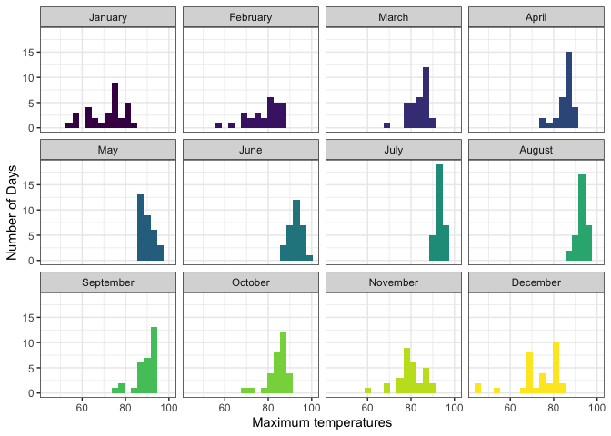
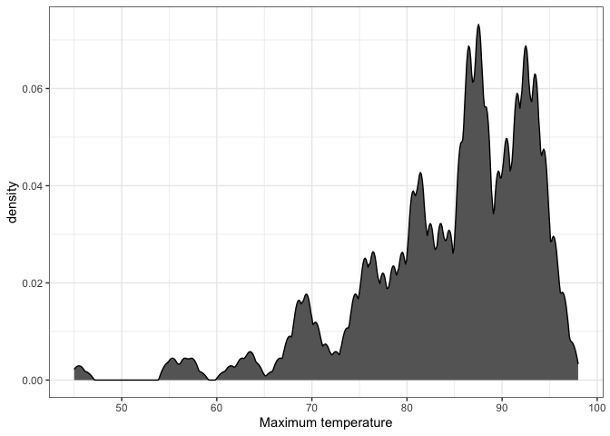
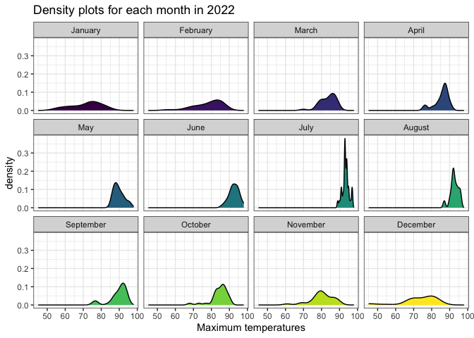
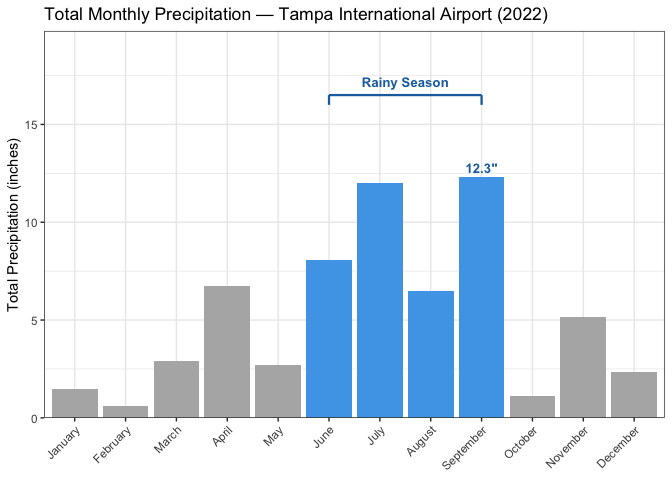
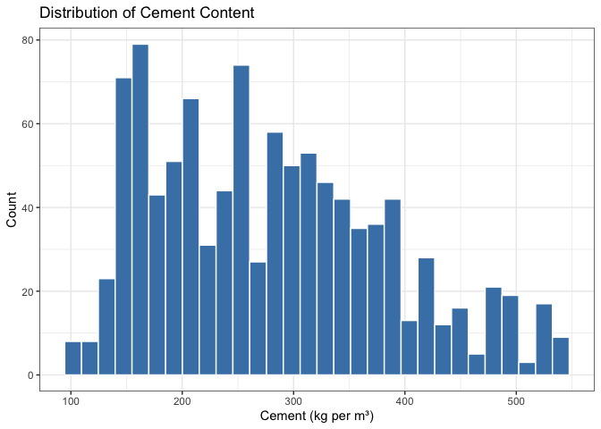
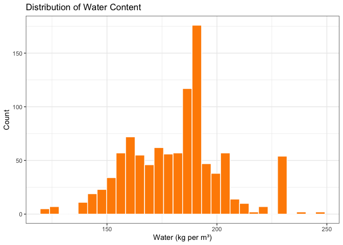
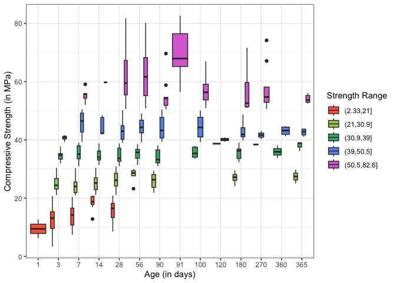
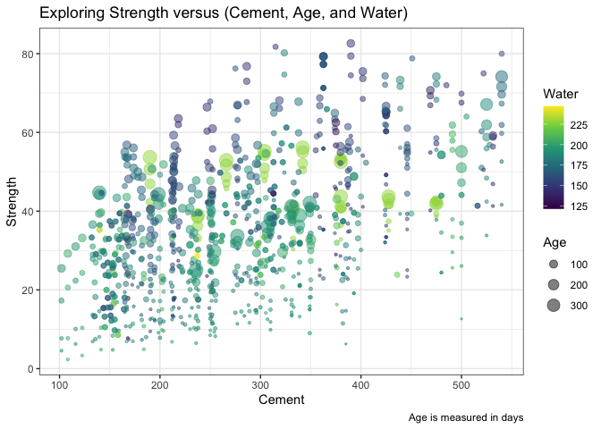
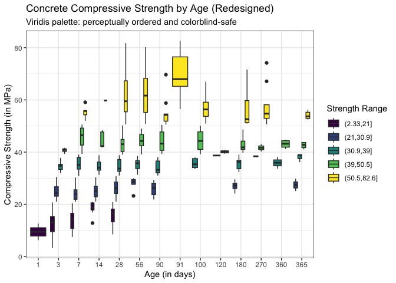

# Data Visualization Project 03


In this exercise you will explore methods to create different types of data visualizations (such as plotting text data, or exploring the distributions of continuous variables).


## PART 1: Density Plots

Using the dataset obtained from FSU's [Florida Climate Center](https://climatecenter.fsu.edu/climate-data-access-tools/downloadable-data), for a station at Tampa International Airport (TPA) for 2022, attempt to recreate the charts shown below which were generated using data from 2016. You can read the 2022 dataset using the code below: 


``` r
library(tidyverse)
library(plotly)
weather_tpa <- read_csv("https://raw.githubusercontent.com/aalhamadani/datasets/master/tpa_weather_2022.csv")
# random sample
sample_n(weather_tpa, 4)
```

```
## # A tibble: 4 × 7
##    year month   day precipitation max_temp min_temp ave_temp
##   <dbl> <dbl> <dbl>         <dbl>    <dbl>    <dbl>    <dbl>
## 1  2022     5     3       0.62          88       71     79.5
## 2  2022     1    28       0.00001       67       54     60.5
## 3  2022    11     9       0.09          76       67     71.5
## 4  2022     5    15       0             88       72     80
```

See Slides from Week 4 of Visualizing Relationships and Models (slide 10) for a reminder on how to use this type of dataset with the `lubridate` package for dates and times (example included in the slides uses data from 2016).


``` r
library(lubridate)

tpa_clean <- weather_tpa %>%
  unite("doy", year, month, day, sep = "-") %>%
  mutate(
    doy = ymd(doy),
    max_temp = as.double(max_temp),
    min_temp = as.double(min_temp),
    precipitation = as.double(precipitation)
  )

# Add month name as ordered factor for proper ordering in plots
tpa_clean <- tpa_clean %>%
  mutate(
    month_name = factor(month(doy, label = TRUE, abbr = FALSE),
      levels = month.name
    )
  )
```

Using the 2022 data: 

(a) Create a plot like the one below:


Hint: the option `binwidth = 3` was used with the `geom_histogram()` function.


``` r
tpa_clean %>%
  filter(!is.na(max_temp), max_temp != -99.9) %>%
  ggplot(aes(x = max_temp, fill = month_name)) +
  geom_histogram(binwidth = 3, show.legend = FALSE) +
  facet_wrap(~month_name, nrow = 3) +
  scale_fill_viridis_d(option = "viridis") +
  labs(
    x = "Maximum temperatures",
    y = "Number of Days"
  ) +
  theme_bw()
```



(b) Create a plot like the one below:


Hint: check the `kernel` parameter of the `geom_density()` function, and use `bw = 0.5`.


``` r
tpa_clean %>%
  filter(!is.na(max_temp), max_temp != -99.9) %>%
  ggplot(aes(x = max_temp)) +
  geom_density(bw = 0.5, kernel = "epanechnikov", fill = "grey40", color = "black") +
  labs(
    x = "Maximum temperature",
    y = "density"
  ) +
  theme_bw()
```



(c) Create a plot like the one below:


Hint: default options for `geom_density()` were used. 


``` r
tpa_clean %>%
  filter(!is.na(max_temp), max_temp != -99.9) %>%
  ggplot(aes(x = max_temp, fill = month_name)) +
  geom_density(color = "black", show.legend = FALSE) +
  facet_wrap(~month_name, nrow = 3) +
  scale_fill_viridis_d(option = "viridis") +
  labs(
    title = "Density plots for each month in 2022",
    x = "Maximum temperatures",
    y = "density"
  ) +
  theme_bw()
```



(d) Generate a plot like the chart below:


Hint: use the`{ggridges}` package, and the `geom_density_ridges()` function paying close attention to the `quantile_lines` and `quantiles` parameters. The plot above uses the `plasma` option (color scale) for the _viridis_ palette.


``` r
library(ggridges)

tpa_clean %>%
  filter(!is.na(max_temp), max_temp != -99.9) %>%
  mutate(month_name = factor(month_name, levels = month.name)) %>%
  ggplot(aes(x = max_temp, y = month_name, fill = stat(x))) +
  geom_density_ridges_gradient(
    quantile_lines = TRUE,
    quantiles = 2,
    scale = 1.5
  ) +
  scale_fill_viridis_c(option = "plasma") +
  labs(
    x = "Maximum temperature (in Fahrenheit degrees)",
    y = NULL,
    fill = NULL
  ) +
  theme_bw() +
  scale_y_discrete(limits = month.name)
```


(e) Create a plot of your choice that uses the attribute for precipitation _(values of -99.9 for temperature or -99.99 for precipitation represent missing data)_.


``` r
# Calculate total monthly precipitation, excluding missing values
tpa_monthly_precip <- tpa_clean %>%
  filter(!is.na(precipitation), precipitation != -99.99) %>%
  group_by(month_name) %>%
  summarise(total_precip = sum(precipitation), .groups = "drop") %>%
  # Mark Florida's rainy season: June through September
  mutate(rainy_season = month_name %in% c("June", "July", "August", "September"))

# Find the peak month for annotation
peak_month <- tpa_monthly_precip %>% slice_max(total_precip, n = 1)

ggplot(tpa_monthly_precip, aes(x = month_name, y = total_precip, fill = rainy_season)) +
  geom_col() +
  # Annotate the rainy season with a bracket
  annotate("segment",
    x = 6, xend = 9, y = 16.5, yend = 16.5,
    color = "#1a6faf", linewidth = 0.8
  ) +
  annotate("segment", x = 6, xend = 6, y = 16.0, yend = 16.5, color = "#1a6faf", linewidth = 0.8) +
  annotate("segment", x = 9, xend = 9, y = 16.0, yend = 16.5, color = "#1a6faf", linewidth = 0.8) +
  annotate("text",
    x = 7.5, y = 17.2,
    label = "Rainy Season", color = "#1a6faf", fontface = "bold", size = 3.5
  ) +
  # Label the peak month
  geom_text(
    data = peak_month,
    aes(label = paste0(round(total_precip, 1), '"')),
    vjust = -0.5, fontface = "bold", color = "#1a6faf", size = 3.5
  ) +
  scale_fill_manual(
    values = c("FALSE" = "grey70", "TRUE" = "#4da6e8"),
    guide = "none"
  ) +
  scale_y_continuous(expand = expansion(mult = c(0, 0.15))) +
  labs(
    title = "Total Monthly Precipitation — Tampa International Airport (2022)",
    x = NULL,
    y = "Total Precipitation (inches)"
  ) +
  theme_bw() +
  theme(axis.text.x = element_text(angle = 45, hjust = 1))
```



**Comment:** Total precipitation was aggregated per month to accurately capture the seasonal pattern — an earlier per-event boxplot was misleading because April had only 7 rainy days, but each was a heavy isolated event, inflating its median. Summing totals gives the correct climatological picture.

Color is used purposefully rather than decoratively: only Florida's official rainy season (June–September) is highlighted in blue, drawing the reader's eye directly to the story. All other months are shown in grey to recede into the background. A bracket annotation reinforces the grouping without relying on the reader to infer it from color alone. The peak month (July, 14.4") is labeled directly on the chart, eliminating the need to estimate from the axis.

## Visualization (Interactive): Monthly Precipitation

The bar chart above is static. This interactive version lets the reader hover over each bar to see the exact total precipitation value and whether the month falls within Florida's rainy season — details that would require printed labels or axis estimation in the static version.


``` r
p_precip <- tpa_monthly_precip %>%
  mutate(
    label = paste0(
      month_name,
      "\nTotal: ", round(total_precip, 2), '"',
      "\nRainy Season: ", ifelse(rainy_season, "Yes", "No")
    )
  ) %>%
  ggplot(aes(x = month_name, y = total_precip, fill = rainy_season, text = label)) +
  geom_col() +
  scale_fill_manual(
    values = c("FALSE" = "grey70", "TRUE" = "#4da6e8"),
    guide = "none"
  ) +
  scale_y_continuous(expand = expansion(mult = c(0, 0.15))) +
  labs(
    title = "Total Monthly Precipitation — Tampa International Airport (2022)",
    x = NULL,
    y = "Total Precipitation (inches)"
  ) +
  theme_bw() +
  theme(axis.text.x = element_text(angle = 45, hjust = 1))

ggplotly(p_precip, tooltip = "text")
```

```{=html}
<div class="plotly html-widget html-fill-item" id="htmlwidget-24e1b92f5f25954ff07b" style="width:672px;height:480px;"></div>
<script type="application/json" data-for="htmlwidget-24e1b92f5f25954ff07b">{"x":{"data":[{"orientation":"v","width":[0.89999999999999991,0.90000000000000013,0.90000000000000036,0.90000000000000036,0.90000000000000036,0.89999999999999858,0.89999999999999858,0.89999999999999858],"base":[0,0,0,0,0,0,0,0],"x":[1,2,3,4,5,10,11,12],"y":[1.4600400000000002,0.62002000000000002,2.9100200000000003,6.7599999999999998,2.7100200000000001,1.1000299999999998,5.1800399999999973,2.3500100000000002],"text":["January<br />Total: 1.46\"<br />Rainy Season: No","February<br />Total: 0.62\"<br />Rainy Season: No","March<br />Total: 2.91\"<br />Rainy Season: No","April<br />Total: 6.76\"<br />Rainy Season: No","May<br />Total: 2.71\"<br />Rainy Season: No","October<br />Total: 1.1\"<br />Rainy Season: No","November<br />Total: 5.18\"<br />Rainy Season: No","December<br />Total: 2.35\"<br />Rainy Season: No"],"type":"bar","textposition":"none","marker":{"autocolorscale":false,"color":"rgba(179,179,179,1)","line":{"width":1.8897637795275593,"color":"transparent"}},"showlegend":false,"xaxis":"x","yaxis":"y","hoverinfo":"text","frame":null},{"orientation":"v","width":[0.90000000000000036,0.90000000000000036,0.89999999999999947,0.89999999999999858],"base":[0,0,0,0],"x":[6,7,8,9],"y":[8.0700300000000009,11.990029999999997,6.5100499999999988,12.29002],"text":["June<br />Total: 8.07\"<br />Rainy Season: Yes","July<br />Total: 11.99\"<br />Rainy Season: Yes","August<br />Total: 6.51\"<br />Rainy Season: Yes","September<br />Total: 12.29\"<br />Rainy Season: Yes"],"type":"bar","textposition":"none","marker":{"autocolorscale":false,"color":"rgba(77,166,232,1)","line":{"width":1.8897637795275593,"color":"transparent"}},"showlegend":false,"xaxis":"x","yaxis":"y","hoverinfo":"text","frame":null}],"layout":{"margin":{"t":40.840182648401829,"r":7.3059360730593621,"b":39.266363793525933,"l":37.260273972602747},"plot_bgcolor":"rgba(255,255,255,1)","paper_bgcolor":"rgba(255,255,255,1)","font":{"color":"rgba(0,0,0,1)","family":"","size":14.611872146118724},"title":{"text":"Total Monthly Precipitation — Tampa International Airport (2022)","font":{"color":"rgba(0,0,0,1)","family":"","size":17.534246575342465},"x":0,"xref":"paper"},"xaxis":{"domain":[0,1],"automargin":true,"type":"linear","autorange":false,"range":[0.40000000000000002,12.6],"tickmode":"array","ticktext":["January","February","March","April","May","June","July","August","September","October","November","December"],"tickvals":[1,2,3,4.0000000000000009,5,6,7.0000000000000009,8,9,10,11,12],"categoryorder":"array","categoryarray":["January","February","March","April","May","June","July","August","September","October","November","December"],"nticks":null,"ticks":"outside","tickcolor":"rgba(51,51,51,1)","ticklen":3.6529680365296811,"tickwidth":0.66417600664176002,"showticklabels":true,"tickfont":{"color":"rgba(77,77,77,1)","family":"","size":11.68949771689498},"tickangle":-45,"showline":false,"linecolor":null,"linewidth":0,"showgrid":true,"gridcolor":"rgba(235,235,235,1)","gridwidth":0.66417600664176002,"zeroline":false,"anchor":"y","title":{"text":"","font":{"color":"rgba(0,0,0,1)","family":"","size":14.611872146118724}},"hoverformat":".2f"},"yaxis":{"domain":[0,1],"automargin":true,"type":"linear","autorange":false,"range":[0,14.133523],"tickmode":"array","ticktext":["0","5","10"],"tickvals":[0,5,10],"categoryorder":"array","categoryarray":["0","5","10"],"nticks":null,"ticks":"outside","tickcolor":"rgba(51,51,51,1)","ticklen":3.6529680365296811,"tickwidth":0.66417600664176002,"showticklabels":true,"tickfont":{"color":"rgba(77,77,77,1)","family":"","size":11.68949771689498},"tickangle":-0,"showline":false,"linecolor":null,"linewidth":0,"showgrid":true,"gridcolor":"rgba(235,235,235,1)","gridwidth":0.66417600664176002,"zeroline":false,"anchor":"x","title":{"text":"Total Precipitation (inches)","font":{"color":"rgba(0,0,0,1)","family":"","size":14.611872146118724}},"hoverformat":".2f"},"shapes":[{"type":"rect","fillcolor":"rgba(255,255,255,1)","line":{"color":"rgba(51,51,51,1)","width":0.66417600664176002,"linetype":"solid"},"yref":"paper","xref":"paper","layer":"below","x0":0,"x1":1,"y0":0,"y1":1}],"showlegend":false,"legend":{"bgcolor":"rgba(255,255,255,1)","bordercolor":"transparent","borderwidth":1.8897637795275593,"font":{"color":"rgba(0,0,0,1)","family":"","size":11.68949771689498},"title":{"text":"","font":{"color":"rgba(0,0,0,1)","family":"","size":14.611872146118724}}},"hovermode":"closest","barmode":"relative"},"config":{"doubleClick":"reset","modeBarButtonsToAdd":["hoverclosest","hovercompare"],"showSendToCloud":false},"source":"A","attrs":{"9a474398b32d":{"x":{},"y":{},"fill":{},"text":{},"type":"bar"}},"cur_data":"9a474398b32d","visdat":{"9a474398b32d":["function (y) ","x"]},"highlight":{"on":"plotly_click","persistent":false,"dynamic":false,"selectize":false,"opacityDim":0.20000000000000001,"selected":{"opacity":1},"debounce":0},"shinyEvents":["plotly_hover","plotly_click","plotly_selected","plotly_relayout","plotly_brushed","plotly_brushing","plotly_clickannotation","plotly_doubleclick","plotly_deselect","plotly_afterplot","plotly_sunburstclick"],"base_url":"https://plot.ly"},"evals":[],"jsHooks":[]}</script>
```


## PART 2 

### Option (B): Data on Concrete Strength 

Concrete is the most important material in **civil engineering**. The concrete compressive strength is a highly nonlinear function of _age_ and _ingredients_. The dataset used here is from the [UCI Machine Learning Repository](https://archive.ics.uci.edu/ml/index.php), and it contains 1030 observations with 9 different attributes 9 (8 quantitative input variables, and 1 quantitative output variable). A data dictionary is included below: 


Variable                      |    Notes                
------------------------------|-------------------------------------------
Cement                        | kg in a $m^3$ mixture             
Blast Furnace Slag            | kg in a $m^3$ mixture  
Fly Ash                       | kg in a $m^3$ mixture             
Water                         | kg in a $m^3$ mixture              
Superplasticizer              | kg in a $m^3$ mixture
Coarse Aggregate              | kg in a $m^3$ mixture
Fine Aggregate                | kg in a $m^3$ mixture      
Age                           | in days                                             
Concrete compressive strength | MPa, megapascals


Below we read the `.csv` file using `readr::read_csv()` (the `readr` package is part of the `tidyverse`)


``` r
concrete <- read_csv("../data/concrete.csv", col_types = cols())
```


Let us create a new attribute for visualization purposes, `strength_range`: 


``` r
new_concrete <- concrete %>%
  mutate(strength_range = cut(Concrete_compressive_strength,
    breaks = quantile(Concrete_compressive_strength,
      probs = seq(0, 1, 0.2)
    )
  ))
```


1. Explore the distribution of 2 of the continuous variables available in the dataset. Do ranges make sense? Comment on your findings.


``` r
# Distribution of Cement
ggplot(concrete, aes(x = Cement)) +
  geom_histogram(bins = 30, fill = "steelblue", color = "white") +
  labs(
    title = "Distribution of Cement Content",
    x = "Cement (kg per m³)",
    y = "Count"
  ) +
  theme_bw()
```




``` r
# Distribution of Water
ggplot(concrete, aes(x = Water)) +
  geom_histogram(bins = 30, fill = "darkorange", color = "white") +
  labs(
    title = "Distribution of Water Content",
    x = "Water (kg per m³)",
    y = "Count"
  ) +
  theme_bw()
```



**Comment:** Cement ranges from roughly 100 to 540 kg/m³, which is consistent with typical concrete mix designs — low cement mixes are used for lean concrete, while higher-cement mixes target high strength. The distribution is roughly right-skewed, with many observations clustering around 200–400 kg/m³. Water content ranges from about 120 to 250 kg/m³, which is realistic (a water-to-cement ratio of 0.3–0.6 is standard). Both ranges are physically plausible and align with known civil engineering practices.

2. Use a _temporal_ indicator such as the one available in the variable `Age` (measured in days). Generate a plot similar to the one shown below. Comment on your results.


``` r
new_concrete %>%
  filter(!is.na(strength_range)) %>%
  mutate(Age = factor(Age)) %>%
  ggplot(aes(x = Age, y = Concrete_compressive_strength, fill = strength_range)) +
  geom_boxplot(position = position_dodge(width = 0.8)) +
  scale_fill_manual(
    values = c("tomato", "darkolivegreen3", "mediumseagreen", "cornflowerblue", "orchid"),
    name = "Strength Range"
  ) +
  labs(
    x = "Age (in days)",
    y = "Compressive Strength (in MPa)"
  ) +
  theme_bw()
```



**Comment:** Concrete strength increases substantially with age, especially in the early curing period (days 1–28). This is expected — hydration of cement continues over time, increasing compressive strength. Samples in the highest strength range (magenta/orchid) become more prominent at later ages (56, 90, 91, 100+ days), while samples in the lowest strength range (red) dominate at age 1. The spread within each age group is large, reflecting the fact that strength depends heavily on the mix composition in addition to age.

3. Create a scatterplot similar to the one shown below. Pay special attention to which variables are being mapped to specific aesthetics of the plot. Comment on your results. 


``` r
ggplot(concrete, aes(
  x = Cement,
  y = Concrete_compressive_strength,
  size = Age,
  color = Water
)) +
  geom_point(alpha = 0.5) +
  scale_color_viridis_c(option = "viridis") +
  scale_size_continuous(range = c(0.5, 5), breaks = c(100, 200, 300)) +
  labs(
    title = "Exploring Strength versus (Cement, Age, and Water)",
    x = "Cement",
    y = "Strength",
    size = "Age",
    color = "Water",
    caption = "Age is measured in days"
  ) +
  theme_bw() +
  theme(plot.caption = element_text(hjust = 1))
```



**Comment:** The scatterplot reveals several patterns: (1) Higher cement content is generally associated with higher compressive strength, as seen by points shifting upward as we move right along the x-axis. (2) Older samples (larger circles) tend to be stronger, confirming the age–strength relationship. (3) Water content (color) shows that lower water content (darker/purple tones) tends to correlate with higher strength, consistent with the well-known water-to-cement ratio principle in concrete technology — less water means a denser, stronger concrete.

## Before / After Redesign

The boxplot in Part 2 Q2 used a manually specified set of fill colors — `tomato`, `darkolivegreen3`, `mediumseagreen`, `cornflowerblue`, and `orchid`. This is an informal rainbow-style palette: the five colors are not perceptually ordered and several pairs (e.g., green vs. green, red vs. orange) are difficult to distinguish under common colorblindness conditions.

**What was wrong:**

- `tomato` and `darkolivegreen3` are both warm-toned and easily confused under deuteranopia (red-green colorblindness)
- The palette has no perceptual ordering — there is no gradient to help the reader map low→high strength
- `orchid` and `cornflowerblue` are similar in lightness, making them hard to tell apart in print

**Before (the original boxplot above already shows this).**

**After (redesigned with `scale_fill_viridis_d()`):**

The viridis palette is perceptually uniform and colorblind-safe. The ordered gradient (purple → green → yellow) naturally reinforces the low-to-high ordering of the strength ranges.


``` r
new_concrete %>%
  filter(!is.na(strength_range)) %>%
  mutate(Age = factor(Age)) %>%
  ggplot(aes(x = Age, y = Concrete_compressive_strength, fill = strength_range)) +
  geom_boxplot(position = position_dodge(width = 0.8)) +
  scale_fill_viridis_d(option = "viridis", name = "Strength Range") +
  labs(
    title = "Concrete Compressive Strength by Age (Redesigned)",
    subtitle = "Viridis palette: perceptually ordered and colorblind-safe",
    x = "Age (in days)",
    y = "Compressive Strength (in MPa)"
  ) +
  theme_bw()
```


